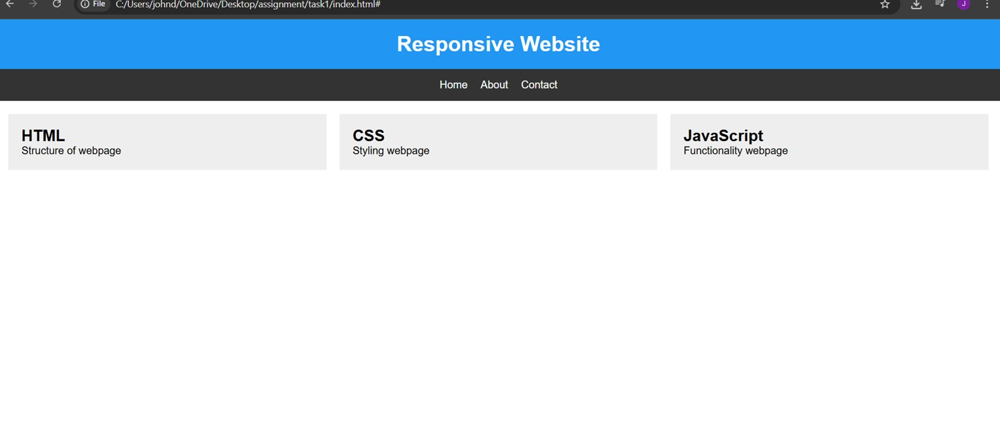
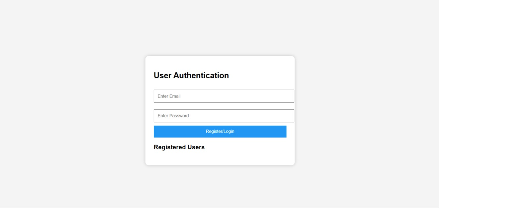
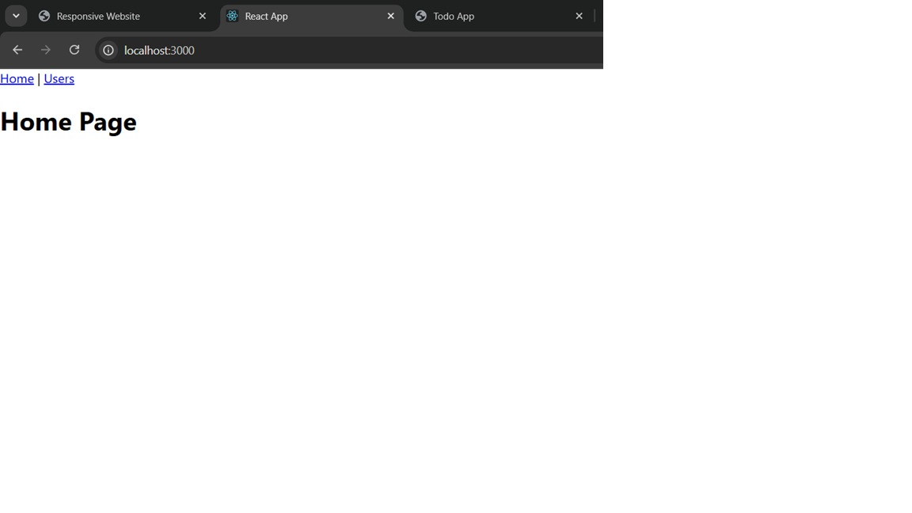
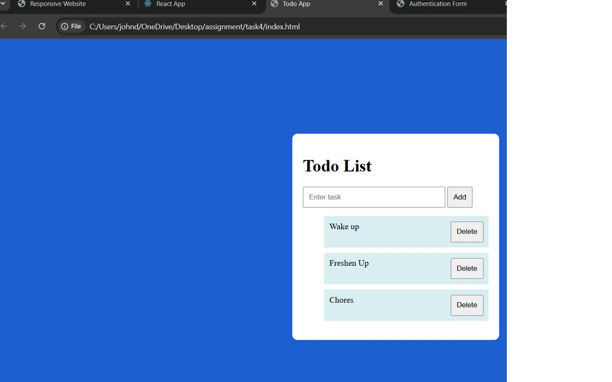

Technologies Used
HTML5
CSS3
JavaScript
React.js
React Router
Fetch API
GitHub
Task 1 – Responsive Webpage
Description

Developed a responsive webpage using HTML, CSS, and JavaScript.

Features
Responsive design
Navigation menu

Task 2 – User Authentication Form
Description

Developed an authentication form with client-side validation.

Features
Email validation
Password validation
User registration
Local Storage support
Display of registered users

Task 3 – Single Page Application (SPA)
Description

Built a React-based Single Page Application that fetches and displays dynamic data from an API.

Features
React Router navigation
Home page
Users page
API integration
Dynamic rendering of user data

Task 4 – Todo Application
Description

Developed a responsive Todo application.

Features
Add tasks
Delete tasks
Mark tasks as completed
Local Storage persistence
Responsive interface

Screenshots Task 1

Task 2

Task 3

Task 4

